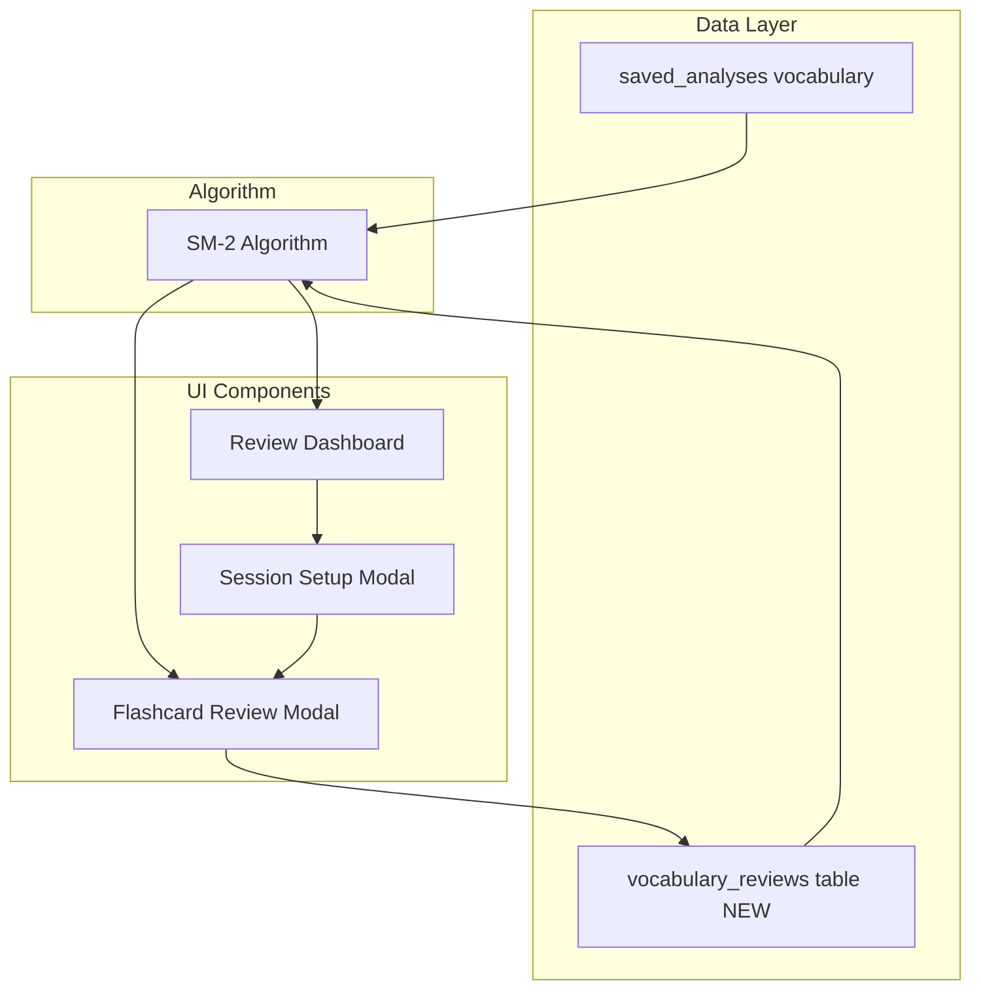
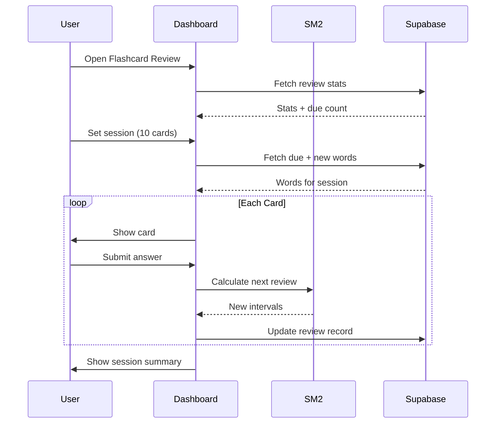

# Spaced Repetition Flashcard System

> Implementation plan for SM-2 based spaced repetition flashcard review system.
> Completed: January 2026

## Overview

Replace Topic Strategy with a SM-2 spaced repetition flashcard review system. This includes a new database table for tracking review progress, an SM-2 algorithm implementation, a review dashboard with stats, and a flashcard review interface with configurable session sizes.

## Architecture Overview



## Implementation Tasks (All Completed)

- [x] Create vocabulary_reviews table in Supabase with SM-2 fields
- [x] Add VocabularyReview, ReviewStats, ReviewSession types and update AppMode enum
- [x] Create sm2Algorithm.ts with SM-2 calculation functions
- [x] Add vocabulary review CRUD methods to dataService.ts
- [x] Create FlashcardReview.tsx component with dashboard and review interface
- [x] Update App.tsx to use FlashcardReview instead of Topic Strategy
- [x] Remove Topic Strategy code from geminiService.ts and App.tsx

## 1. Database Schema (Supabase)

Create a new `vocabulary_reviews` table to track SM-2 parameters per vocabulary term:

```sql
CREATE TABLE vocabulary_reviews (
  id UUID PRIMARY KEY DEFAULT gen_random_uuid(),
  user_id UUID REFERENCES auth.users(id) NOT NULL,
  term TEXT NOT NULL,
  definition TEXT NOT NULL,
  source_analysis_id UUID REFERENCES saved_analyses(id),
  -- SM-2 parameters
  ease_factor REAL DEFAULT 2.5,
  interval INTEGER DEFAULT 0,  -- days until next review
  repetitions INTEGER DEFAULT 0,
  next_review_date TIMESTAMPTZ DEFAULT NOW(),
  last_review_date TIMESTAMPTZ,
  -- User actions
  is_suspended BOOLEAN DEFAULT FALSE,  -- "don't show again"
  is_mastered BOOLEAN DEFAULT FALSE,
  -- Stats
  correct_count INTEGER DEFAULT 0,
  incorrect_count INTEGER DEFAULT 0,
  created_at TIMESTAMPTZ DEFAULT NOW(),
  UNIQUE(user_id, term)
);
```

## 2. Types (types.ts)

Added new types:

```typescript
// SM-2 Review Quality Rating
export type ReviewQuality = 0 | 1 | 2 | 3 | 4 | 5;

// Simplified quality for UI (maps to SM-2 qualities)
export type SimpleQuality = 'again' | 'hard' | 'good' | 'easy';

export interface VocabularyReview {
  id: string;
  term: string;
  definition: string;
  sourceAnalysisId?: string;
  easeFactor: number;
  interval: number;
  repetitions: number;
  nextReviewDate: Date;
  lastReviewDate?: Date;
  isSuspended: boolean;
  isMastered: boolean;
  correctCount: number;
  incorrectCount: number;
  createdAt: Date;
  category?: VocabularyCategory;
  sourceContext?: string;
  examples?: DetailedExample[];
}

export interface ReviewStats {
  totalWords: number;
  masteredWords: number;
  learningWords: number;
  newWords: number;
  dueToday: number;
  suspendedWords: number;
  masteryPercentage: number;
}
```

Updated `AppMode` enum:

```typescript
export enum AppMode {
  ANALYZE_TEXT = 'analyze_text',
  FLASHCARD_REVIEW = 'flashcard_review',  // Replaces TOPIC_STRATEGY
  HISTORY = 'history'
}
```

## 3. SM-2 Algorithm (services/sm2Algorithm.ts)

Key functions implemented:

- `simpleToSM2Quality()` - Maps UI quality to SM-2 rating
- `calculateNewEaseFactor()` - Updates ease factor based on performance
- `calculateNextInterval()` - Calculates days until next review
- `calculateNextReview()` - Main function that returns all updated SM-2 values
- `previewIntervals()` - Shows what intervals each choice would produce
- `getIntervalDescription()` - Human-readable interval ("1 day", "2 weeks", etc.)

SM-2 Quality Ratings:
- 0-2: Incorrect - reset to 1 day interval
- 3: Correct with difficulty
- 4: Correct with hesitation
- 5: Perfect recall

## 4. Data Service (services/dataService.ts)

Added new methods:

- `fetchVocabularyReviews(userId)` - Get all reviews
- `fetchDueReviews(userId, limit)` - Get words due for review (repetitions > 0)
- `fetchNewWordsForReview(userId, limit)` - Get unreviewed words
- `getReviewStats(userId)` - Get dashboard statistics
- `upsertVocabularyReview(userId, review)` - Create/update review
- `updateReviewAfterAnswer(userId, reviewId, quality)` - Apply SM-2 after answer
- `suspendWord(userId, reviewId)` - Mark "don't show again"
- `syncVocabFromAnalyses(userId, analyses)` - Import vocabulary from saved analyses

## 5. FlashcardReview Component (components/FlashcardReview.tsx)

### Dashboard Section
- Total words count with progress bar
- Mastery percentage
- Due today count
- Learning/mastered/new breakdown
- "Start Review" and "Sync Vocabulary" buttons

### Session Setup Modal
- Number selector (5, 10, 15, 20, 30)
- Toggle: Include new words
- Toggle: Include due reviews

### Review Interface
- Card showing definition and masked example
- Answer input field
- After answer: Show correct term with pronunciation
- Quality rating buttons with keyboard shortcuts
- Auto-play pronunciation when answer revealed

### Keyboard Shortcuts
- `A` = Again
- `S` = Hard
- `D` / `Space` = Good
- `F` = Easy
- `N` = Don't show again

## 6. Data Flow



## Files Created/Modified

| File | Action |
|------|--------|
| `types.ts` | Added SRS types, updated AppMode |
| `services/sm2Algorithm.ts` | NEW - SM-2 implementation |
| `services/dataService.ts` | Added review CRUD methods |
| `components/FlashcardReview.tsx` | NEW - Main review component |
| `App.tsx` | Replaced Topic Strategy with Flashcard Review |
| `services/geminiService.ts` | Removed generateTopicStrategy |
| `supabase/migrations/001_vocabulary_reviews.sql` | Database migration |

## Post-Implementation Enhancements

1. Auto-play pronunciation when answer is revealed
2. Keyboard shortcuts (ASDF for rating, N for suspend, Space for Good)
3. Vocabulary sync from oldest analyses first
4. Fixed session size to give full requested card count
